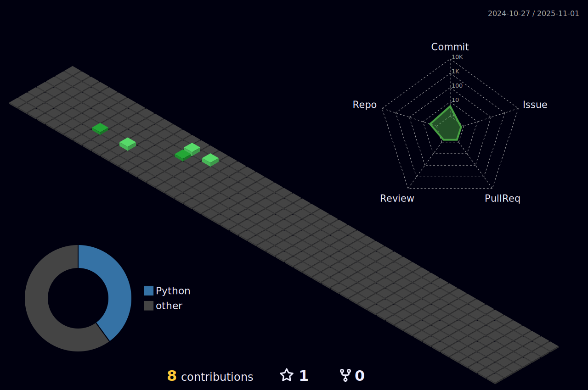

<h1>Hello! I'm Bernardo Brito  🚀</h1>
<h2>Fullstack Developer</h2>

### About Me:

 - I'm Bernardo, 22 years old, from Brazil.
 - I'm a Microsoft ambassador and a Computer Engineering student at UFRN with an interuniversity program at FEUP.
 - I've been involved in research to develop a platform for street vendors during the pandemic.
 - I'm part of a junior university company specializing in IT consulting.
 - I've participated in two exchange programs to the USA.

  
  

  
 |  |  |  
 | ----------- | ----------- |

 
  

   

  

 
##
   

     
  

  
 

 
  
  

  

